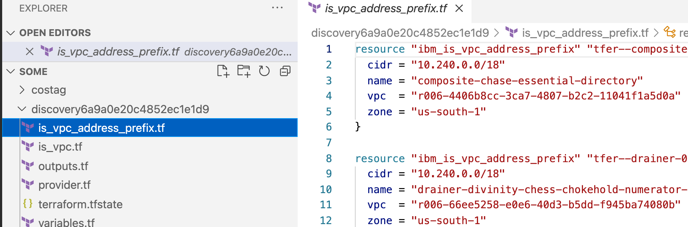
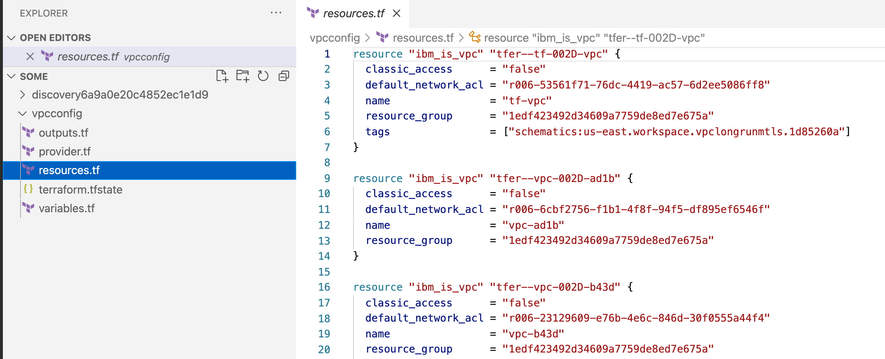

# IBM Cloud Configuration Discovery

The objective of this executable is make life easy for people having to write terraform code for their existing resources. If you already have your infrastructure provisioned on IBM cloud and you're now moving to IaC, this tool will help you. This executable will be available as standalone as well as part of the [schematics vscode extension](https://github.ibm.com/vishwak1/vscode-ibmcloud-schematics). For more general understanding of IBM Cloud Configuration Discovery, read this [blog](https://ibm.box.com/s/0ou4erd2t65ndiv1v83egfjgle699pcy).

<!-- todo Change the vscode extension link to public extension page later -->
<!-- todo Change the box link to blog link -->


## Using the discovery executable

To use the discovery executable, [terraform](https://learn.hashicorp.com/tutorials/terraform/install-cli) and [terrafomer](https://github.com/GoogleCloudPlatform/terraformer/releases) are prerequisites. 


### Build from code

- Clone and install the executable to your GOPATH
    ```
        make install-cli
    ```

### Install precompiled binary

- Head over to the [releases page](https://github.com/anilkumarnagaraj/terraform-provider-ibm-api/releases) and download the appropriate latest release. 
- After downloading discovery, unzip the package. Discovery runs as a single binary named terraform. 
- Place the binary under the path. For example,
    ```
        mv discovery <$GOPATH/bin or any other directory in path>
    ```

- Or, If you have go installed, run this command 
    ```
        go install github.com/anilkumarnagaraj/terraform-provider-ibm-api/cmd/discovery
    ```

<!-- Need to verify and update this. Add the -u flag to update -->


### Usage

- Export the required env vars 
    * IC_API_KEY: Your ibm cloud api key. Imports resources in that account, for which user has access.
    * DISCOVERY_CONFIG_DIR: Directory, where to generate and import the terraform code. discovery uses only this directory for any read/write op.
- Run `discovery help` to see all the commands. Run `discovery help <command>` to 
- Example commands
       discovery version
       discovery config --config_name testfolder
       discovery import --services ibm_is_vpc --config_name testfolder --compact --merge


### Tutorial with examples

- Run `discovery version`. This will show the version of the discovery binary and all the services and resources that can be imported. Here is the list of services and the supported resources.
    ```
        Discovery v0.0.1 on unix
        List of IBM Cloud resources that can be imported:
        services                    resources
        ibm_kp                      ibm_resource_instance
                                    ibm_kms_key

        ibm_cos                     ibm_resource_instance
                                    ibm_cos_bucket

        ibm_iam                     ibm_iam_user_policy
                                    ibm_iam_access_group
                                    ibm_iam_access_group_members
                                    ibm_iam_access_group_policy
                                    ibm_iam_access_group_dynamic_rule

        ibm_container_vpc_cluster   ibm_container_vpc_cluster
                                    ibm_container_vpc_worker_pool

        ibm_database_etcd           ibm_database

        ibm_database_mongo          ibm_database

        ibm_database_postgresql     ibm_database

        ibm_database_rabbitmq       ibm_database

        ibm_database_redis          ibm_database

        ibm_is_instance_group       ibm_is_instance_group
                                    ibm_is_instance_group_manager
                                    ibm_is_instance_group_manager_policy

        ibm_cis                     ibm_cis
                                    ibm_cis_dns_record
                                    ibm_cis_firewall
                                    ibm_cis_domain_settings
                                    ibm_cis_global_load_balancer
                                    ibm_cis_edge_functions_action
                                    ibm_cis_edge_functions_trigger
                                    ibm_cis_healthcheck
                                    ibm_cis_rate_limit

        ibm_is_vpc                  ibm_is_vpc
                                    ibm_is_vpc_address_prefix
                                    ibm_is_vpc_route
                                    ibm_is_vpc_routing_table
                                    ibm_is_vpc_routing_table_route
                                    ibm_is_subnet
                                    ibm_is_instance

        ibm_is_security_group       ibm_is_security_group_rule
                                    ibm_is_network_acl
                                    ibm_is_public_gateway
                                    ibm_is_volume

        ibm_is_vpn_gateway          ibm_is_vpn_gateway_connections

        ibm_is_lb                   ibm_is_lb_pool
                                    ibm_is_lb_pool_member
                                    ibm_is_lb_listener
                                    ibm_is_lb_listener_policy
                                    ibm_is_lb_listener_policy_rule
                                    ibm_is_floating_ip
                                    ibm_is_flow_log
                                    ibm_is_ike_policy
                                    ibm_is_image
                                    ibm_is_instance_template
                                    ibm_is_ipsec_policy
                                    ibm_is_ssh_key

        ibm_function                ibm_function_package
                                    ibm_function_action
                                    ibm_function_rule
                                    ibm_function_trigger

        ibm_private_dns             ibm_resource_instance
                                    ibm_dns_zone
                                    ibm_dns_resource_record
                                    ibm_dns_permitted_network
                                    ibm_dns_glb_monitor
                                    ibm_dns_glb_pool
                                    ibm_dns_glb
    ```

- You have a vpc created in the IBM cloud, but now you want to maintain this vpc using terraform. 
    ```
        discovery import --services ibm_is_vpc
    ```

    For example, this imported the resources ibm_is_vpc and ibm_is_vpc_address_prefix in my account 

    

    Instead, to get all the resources in a single terraform file, run
    ```
        discovery import --services ibm_is_vpc --compact
    ```

    Here, the name of the folder inside DISCOVERY_CONFIG_DIR, is randomly generated string. To pass a proper folder_name. If this folder already exists, make sure it is empty. Merging will old terraform files is not supported yet.
    ```
        discovery import --services ibm_is_vpc --config_name vpcconfig --compact
    ```

    

- Import all the access_groups in your account. This is one resource `ibm_iam_access_group` of service `ibm_iam`. Run
    ```
        discovery import --services ibm_iam_access_group --config_name myaccessgroups
    ```

- Import a particular vpc. You can use tags to filter the resources. Run 
    ```
        discovery import --services ibm_vpc --tags resource_group:1edf423492d34609a7759de8ed7e675a --config_name vpctag --compact
    ```


<!-- verify the redis example -->


## Future enhancements

- Import will support a new flag `--merge`. This can be used to import the resources and merge with existing terraform statefile and configuration. 
- Configure will support ensuring the dependencies terraform and terraformer exist. 