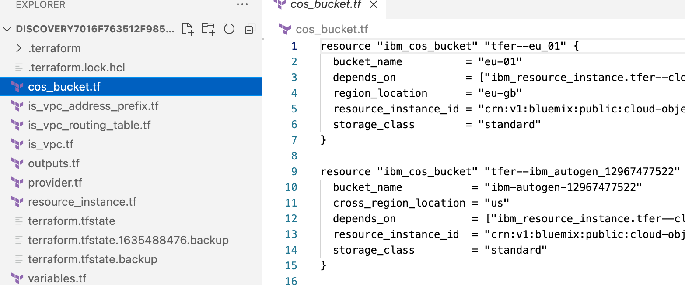
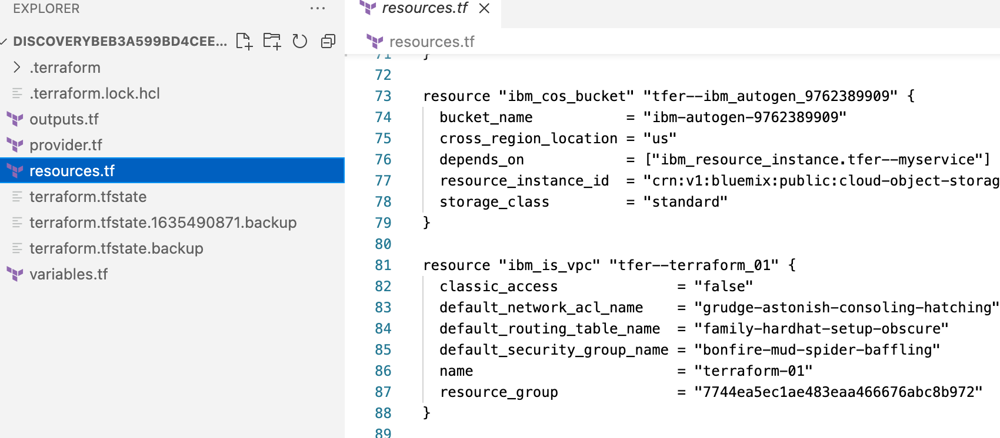

# IBM Cloud Configuration Discovery

Let's take a scenario that you have an infrastructure containing multiple services provisioned on IBM Cloud. One of your business requirement is to migrate existing infrastructure setup to declarative approach using Terraform. Since you have basic skill of Terraform, thinking more about challenges and workaround to create an entire infrastructure to Terraform.

You need not think about, here is a tutorial that walks your through the [Configuration Discovery](https://test.cloud.ibm.com/docs/ibm-cloud-provider-for-terraform?topic=ibm-cloud-provider-for-terraform-terraformer-intro) to simplify your requirement.
For more information, about getting started with the tool, see [blog](https://ibm.box.com/s/0ou4erd2t65ndiv1v83egfjgle699pcy).

## Table of Contents

- [Prerequisites](#prerequisities)
- [Installation](#installation)
- [Setup your Environment](#setup your environment)
- [Usage](#usage)
- [Validating and Re-creating the Environment](#validating and re-creating the environment)
- [Conclusion](#conclusion)
- [Future Enhancements](#future enhancements)

## Prerequisites

In your local system, following prerequisites must be met to install the Configuration Discovery plugin.
- [Terraform](https://test.cloud.ibm.com/docs/ibm-cloud-provider-for-terraform?topic=ibm-cloud-provider-for-terraform-getting-started#tf_installation)

## Installation

The installation can be done by following two approaches:

**Approach 1**
Install precompiled binary by running following CURL command.

```
curl -qL https://github.com/IBM-Cloud/configuration-discovery/install.sh | sh
```
Clone and install the tool to your GOPATH

```
make install-cli
```

**Approach 2**
Install by using the precompiled binary files manually by following the given steps.

- Download the binary file from the latest [release](https://github.com/IBM-Cloud/configuration-discovery/releases).
- Rename the file to **discovery**, ensure it is executable, and place the binary in the PATH. 

  **Example**
  
  ```
  mv discovery <$GOPATH/bin or any other directory in path>
  ```

    Or, If you have `GO` lang installed, run this command.

    ```
    go install github.com/IBM-Cloud/configuration-discovery/cmd/discovery
    ```
## Setup your Environment

- Export the required `env vars` 
    * IC_API_KEY: Provide your IBM Cloud API key. This imports resources that your account has access.

        ```
        export IC_API_KEY=<IC_API_KEY>
        ```

    * DISCOVERY_CONFIG_DIR: The directory, where you want to generate and import the Terraform code. Configuration Discovery uses only this directory for all the read or write operations.

         ```
         export DISCOVERY_CONFIG_DIR=<PATH>
         ```

## Usage

```
    $> discovery
    NAME:
        IBM Cloud Discovery CLI - Lets you create state file and TF Config from Resources in your cloud account. For the green field and brown field imports of config and statefile, and all terraformer related

    USAGE:
        discovery [global options] command [command options] [arguments...]

    VERSION:
        0.1.1

    COMMANDS:
        help, h  Shows a list of commands or help for one command

        discovery:
            version            discovery version
            config, configure  discovery config [--config_name CONFIG_NAME]
            import             discovery import --services SERVICES_TO_IMPORT [--tags TAGS] [--config_name CONFIG_NAME] [--compact]

    GLOBAL OPTIONS:
        --help, -h     show help
        --version, -v  print the version
```

### version

Version lists the discovery binary and all the services and resources that can be imported. Here is the list of services and the supported resources.

    ````
        $ discovery version
        Configuration Discovery v0.0.1 on unix
        List of IBM Cloud resources that can be imported:
        services                    resources
        ibm_kp                      ibm_resource_instance
                                    ibm_kms_key

        ibm_cos                     ibm_resource_instance
                                    ibm_cos_bucket

        ibm_iam                     ibm_iam_user_policy
                                    ibm_iam_access_group
                                    ibm_iam_access_group_members
                                    ibm_iam_access_group_policy
                                    ibm_iam_access_group_dynamic_rule

        ibm_container_vpc_cluster   ibm_container_vpc_cluster
                                    ibm_container_vpc_worker_pool

        ibm_database_etcd           ibm_database

        ibm_database_mongo          ibm_database

        ibm_database_postgresql     ibm_database

        ibm_database_rabbitmq       ibm_database

        ibm_database_redis          ibm_database

        ibm_is_instance_group       ibm_is_instance_group
                                    ibm_is_instance_group_manager
                                    ibm_is_instance_group_manager_policy

        ibm_cis                     ibm_cis
                                    ibm_cis_dns_record
                                    ibm_cis_firewall
                                    ibm_cis_domain_settings
                                    ibm_cis_global_load_balancer
                                    ibm_cis_edge_functions_action
                                    ibm_cis_edge_functions_trigger
                                    ibm_cis_healthcheck
                                    ibm_cis_rate_limit

        ibm_is_vpc                  ibm_is_vpc
                                    ibm_is_vpc_address_prefix
                                    ibm_is_vpc_route
                                    ibm_is_vpc_routing_table
                                    ibm_is_vpc_routing_table_route
                                    ibm_is_subnet
                                    ibm_is_instance

        ibm_is_security_group       ibm_is_security_group_rule
                                    ibm_is_network_acl
                                    ibm_is_public_gateway
                                    ibm_is_volume

        ibm_is_vpn_gateway          ibm_is_vpn_gateway_connections

        ibm_is_lb                   ibm_is_lb_pool
                                    ibm_is_lb_pool_member
                                    ibm_is_lb_listener
                                    ibm_is_lb_listener_policy
                                    ibm_is_lb_listener_policy_rule
                                    ibm_is_floating_ip
                                    ibm_is_flow_log
                                    ibm_is_ike_policy
                                    ibm_is_image
                                    ibm_is_instance_template
                                    ibm_is_ipsec_policy
                                    ibm_is_ssh_key

        ibm_function                ibm_function_package
                                    ibm_function_action
                                    ibm_function_rule
                                    ibm_function_trigger

        ibm_private_dns             ibm_resource_instance
                                    ibm_dns_zone
                                    ibm_dns_resource_record
                                    ibm_dns_permitted_network
                                    ibm_dns_glb_monitor
                                    ibm_dns_glb_pool
                                    ibm_dns_glb

        ibm_satellite
                                    ibm_satellite_location
                                    ibm_satellite_host                           
    ```

### import

Import command reads an existing infrastructure and export into Terraform files.

**Example 1**

To import resources from IBM VPC service

```
discovery import --services ibm_is_vpc
```

Here is an example that shows how to export Terraform files from an existing infrastructure for the IBM Cloud VPC resources in my account. 


**Example 2**

To import resources from multiple services

```
discovery import --services ibm_is_vpc,ibm_cos
```

Here is an example that exports Terraform files from an existing infrastructure for both `IBM Cloud VPC` and `IBM Cloud Cloud Object Storage` resources in my account.



### `compact`

Compact parameter groups multiple resource files into one `resources.tf` file. 

**Example**

```
discovery import --services ibm_is_vpc,ibm_cos --compact
```

Here is an example to show how `ibm_is_vpc` and `ibm_cos` resources imports in my account and group all the service resources into a single Terraform configuration file.



### `tags`

Tags parameter is used to filter resources by its region or resource group.

**Example**

```
discovery import --services ibm_is_vpc,ibm_cos --tags 'region:us-east,resource_group:default'
```

### config_name

By default discovery will export the Terraform files into directory with the name **discovery<RANDOM_STRING>**. Passing **--config_name <FOLDER_NAME>** parameter will make discovery to expoprt the Terraform files to the specified directory.

**Example** 
    
This command will export the Terraform files into 'vpcconfig' directory.

```
discovery import --services ibm_is_vpc --config_name vpcconfig
```

## Validating and Re-creating the Environment

Now that we’ve captured the environment into Terraform files using the Configuration Discovery tool, you can re-create that environment in the IBM Cloud using terraform. Let’s walk through doing that.

### Scenario

The manually created and deployed an IBM Kubernetes Service and a VPC on the IBM Cloud is working perfectly. Now, you want to import your existing infrastructure into production just as you have it by using Infrastructure as Code. To achieve this requirement, you are asked to use the Configuration Discovery tool, and capture the existing environment into Terraform files. Here are the list of files you need to capture.

- `resources.tf`: Provides the configuration
- `terraform.tfstate`:  Holds the last-known state of the infrastructure
- `variables.tf`:  Contains the value for the declared variables
- `provider.tf`: Defines which provider is need to install Terraform and use
- `outputs.tf`: Allows you to export structured data of your infrastructure

These files represent the environment you have in exisiting cloud environment and want to be duplicated. Now, you have the Terraform files and wanted to create three environments such as `Dev`, `Stage`, and `Prod`. You need replicate these Terraform files three times in a different folder, as one set for each environment type. Then edit the files and inject new input values that are unique to each environment. 

**Sample environment structure**

    .
    ├── ...
    ├── MyApp-Dev               
    │   ├── resources.tf    
    │   ├── terraform.tfstate
    │   ├── variables.tf    
    │   ├── provider.tf      
    │   └── outputs.tf 
    ├── MyApp-Staging               
    │   ├── resources.tf    
    │   ├── variables.tf    
    │   ├── provider.tf      
    │   └── outputs.tf 
    ├── MyApp-Prod               
    │   ├── resources.tf    
    │   ├── variables.tf    
    │   ├── provider.tf      
    │   └── outputs.tf      
    └── ...

**Edit the files**
You need to load the files in an editor, open the `resources.tf` or `variables.tf` file and edit the input values for each environment. And save all three sets of files, you can store them on your disk or in a different directories of your GitHub repository.


### Create environment commands:

- Initialize directory containing Terraform configuration files by executing `terraform init` command.

- Provision the infrastructure by executing `terraform apply` command.

Run the above commands three times on all environment folders such as `MyApp-Dev`, `MyApp-Staging`, and `MyApp-Prod`. Now that you have executed apply commands, and created these environments. Let’s see how to use them.

### View environment commands

- List the IBM Cloud provisioned resource by executing `terraform show` command. 

As you can see, now you have 3 sets of resources for your application MyApp - one for Dev, one for Staging, and one for Prod. You can now deploy your application on development, staging, and production environment. Be confident to view an identical environment as that of you old setup in IBM Cloud.

## Conclusion

This is the process to reverse engineer your existing IBM Cloud environment and re-deploy the environment as you need.

The steps are:

- Use the Configuration Discovery tool to reproduce a manually created cloud environment by capturing the Terraform “Infrastructure to Code” files
- Modify the files to create 3 different environments: Dev, Staging, Prod
- Re-create the resources using Terraform, and then to check they were created as per your setup

Now, you have the ability to take any manually created environments, capture them to re-usable Terraform code files, and re-create in the IBM Cloud for future use.

## Future Enhancements

- Import will support a new flag `--merge`. This can be used to import the resources and merge with existing Terraform state file and configuration. 
- Rewrite Terraform resource into Terraform modules.
- Supports integration of the Configuration Discovery tool into the [VS Code extension for IBM Cloud Schematics](https://www.ibm.com/cloud/blog/announcements/introducing-the-visual-studio-code-extension-for-ibm-cloud-schematics)
