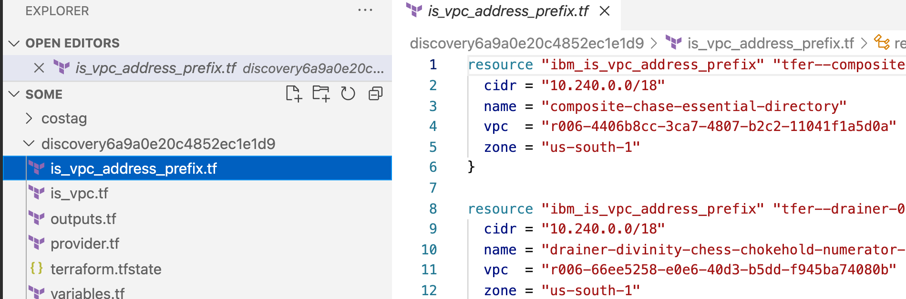

# IBM Cloud Configuration Discovery

Let's take a scenario that you have an infrastructure containing multiple services provisioned on IBM Cloud. One of your business requirement is to migrate existing infrastructure setup to declarative approach using Terraform. Since you have basic skill of Terraform, thinking more about challenges and workaround to create an entire infrastructure to Terraform. 
You need not think about, here is a tutorial that walks your through the [Configuration Discovery](https://test.cloud.ibm.com/docs/ibm-cloud-provider-for-terraform?topic=ibm-cloud-provider-for-terraform-terraformer-intro) to simplify your requirement.
For more information, about getting started with the tool, see [blog](https://ibm.box.com/s/0ou4erd2t65ndiv1v83egfjgle699pcy).

## Table of Contents

- Prerequisites
- Installation and Setup
- Usage
- Validating and Re-creating the Environment

## Prerequisites

In your local system, following prerequisites must be met to install the Configuration Discovery plugin.
- [Terraform](https://test.cloud.ibm.com/docs/ibm-cloud-provider-for-terraform?topic=ibm-cloud-provider-for-terraform-getting-started#tf_installation)

## Installation

The installation can be done by following two approaches:

**Approach 1**
Install precompiled binary by running following CURL command.

```
curl -qL https://github.com/IBM-Cloud/configuration-discovery/install.sh | sh
```
Clone and install the tool to your GOPATH

```
make install-cli
```

**Approach 2**
Install by using the precompiled binary files manually by following the given steps.

- Download the binary file from the latest [release](https://github.com/IBM-Cloud/configuration-discovery/releases).
- Rename the file to **discovery**, ensure it is executable, and place the binary in the PATH. 

  **Example**
  
  ```
  mv discovery <$GOPATH/bin or any other directory in path>
  ```
- Or, If you have `GO` lang installed, run this command.

    ```
    go install github.com/IBM-Cloud/configuration-discovery/cmd/discovery
    ```
### Setup your environment

- Export the required `env vars` 
    * IC_API_KEY: Provide your IBM Cloud API key. This imports resources that your account has access.

        `export IC_API_KEY=<IC_API_KEY>`

    * DISCOVERY_CONFIG_DIR: The directory, where you want to generate and import the Terraform code. Configuration Discovery uses only this directory for all the read or write operations.

         `export DISCOVERY_CONFIG_DIR=<PATH>`

## Usage

```
    $> discovery
    NAME:
        IBM Cloud Discovery CLI - Lets you create state file and TF Config from Resources in your cloud account. For the green field and brown field imports of config and statefile, and all terraformer related

    USAGE:
        discovery [global options] command [command options] [arguments...]

    VERSION:
        0.1.1

    COMMANDS:
        help, h  Shows a list of commands or help for one command

        discovery:
            version            discovery version
            config, configure  discovery config [--config_name CONFIG_NAME]
            import             discovery import --services SERVICES_TO_IMPORT [--tags TAGS] [--config_name CONFIG_NAME] [--compact]

    GLOBAL OPTIONS:
        --help, -h     show help
        --version, -v  print the version
```

### version

- This will show the version of the discovery binary and all the services and resources that can be imported. Here is the list of services and the supported resources.

    ````
        $ discovery version
        Configuration Discovery v0.0.1 on unix
        List of IBM Cloud resources that can be imported:
        services                    resources
        ibm_kp                      ibm_resource_instance
                                    ibm_kms_key

        ibm_cos                     ibm_resource_instance
                                    ibm_cos_bucket

        ibm_iam                     ibm_iam_user_policy
                                    ibm_iam_access_group
                                    ibm_iam_access_group_members
                                    ibm_iam_access_group_policy
                                    ibm_iam_access_group_dynamic_rule

        ibm_container_vpc_cluster   ibm_container_vpc_cluster
                                    ibm_container_vpc_worker_pool

        ibm_database_etcd           ibm_database

        ibm_database_mongo          ibm_database

        ibm_database_postgresql     ibm_database

        ibm_database_rabbitmq       ibm_database

        ibm_database_redis          ibm_database

        ibm_is_instance_group       ibm_is_instance_group
                                    ibm_is_instance_group_manager
                                    ibm_is_instance_group_manager_policy

        ibm_cis                     ibm_cis
                                    ibm_cis_dns_record
                                    ibm_cis_firewall
                                    ibm_cis_domain_settings
                                    ibm_cis_global_load_balancer
                                    ibm_cis_edge_functions_action
                                    ibm_cis_edge_functions_trigger
                                    ibm_cis_healthcheck
                                    ibm_cis_rate_limit

        ibm_is_vpc                  ibm_is_vpc
                                    ibm_is_vpc_address_prefix
                                    ibm_is_vpc_route
                                    ibm_is_vpc_routing_table
                                    ibm_is_vpc_routing_table_route
                                    ibm_is_subnet
                                    ibm_is_instance

        ibm_is_security_group       ibm_is_security_group_rule
                                    ibm_is_network_acl
                                    ibm_is_public_gateway
                                    ibm_is_volume

        ibm_is_vpn_gateway          ibm_is_vpn_gateway_connections

        ibm_is_lb                   ibm_is_lb_pool
                                    ibm_is_lb_pool_member
                                    ibm_is_lb_listener
                                    ibm_is_lb_listener_policy
                                    ibm_is_lb_listener_policy_rule
                                    ibm_is_floating_ip
                                    ibm_is_flow_log
                                    ibm_is_ike_policy
                                    ibm_is_image
                                    ibm_is_instance_template
                                    ibm_is_ipsec_policy
                                    ibm_is_ssh_key

        ibm_function                ibm_function_package
                                    ibm_function_action
                                    ibm_function_rule
                                    ibm_function_trigger

        ibm_private_dns             ibm_resource_instance
                                    ibm_dns_zone
                                    ibm_dns_resource_record
                                    ibm_dns_permitted_network
                                    ibm_dns_glb_monitor
                                    ibm_dns_glb_pool
                                    ibm_dns_glb

        ibm_satellite
                                    ibm_satellite_location
                                    ibm_satellite_host                           
    ```

### import

"import" command will read the existing infrastructure and export the terraform files.

**Example**

- To import resources from IBM VPC service

    `discovery import --services ibm_is_vpc`

    This will export terraform files from existing infrastructure for the IBM VPC resources in my account. 

    

- To import resources from multiple services

    `discovery import --services ibm_is_vpc,ibm_cos`

    This will export terraform files from existing infrastructure for both IBM VPC & IBM COS resources in my account.

    

### compact

-   "compact" parameter will group multiple resource files into one resources.tf file.

    `discovery import --services ibm_is_vpc,ibm_cos --compact`

    For example, this imported the resources ibm_is_vpc and ibm_cos in my account and group all the service resources into a single terraform configuration file.

    

### tags

-   "tags" parameter is used to filter resources by its region or resource group.

    **Example**

    `discovery import --services ibm_is_vpc,ibm_cos --tags 'region:us-east,resource_group:default'`

### config_name

-   By default discovery will export the terraform files in to directory with name "discovery<RANDOM_STRING>".Passing "--config_name <FOLDER_NAME>" parameter will make discovery to expoprt the terraform files to specified directory.

    **Example** 
    
    This will export the terraform files into 'vpcconfig' directory.

    `discovery import --services ibm_is_vpc --config_name vpcconfig`


## Validating and Re-creating the Environment

Now that we’ve captured the environment into Terraform files using the Configuration Discovery tool, you can re-create that environment in the IBM Cloud using terraform. Let’s walk through doing that.

### Scenario

You’ve manually created an IBM Kubernetes Service and a VPC on the IBM Cloud, you’ve deployed your application, and it’s working perfectly. Now, you want to put that into production just as you have it, using Infrastructure as Code, so you’ve run the Configuration Discovery tool, and captured that environment to Terraform files. These are the files you’ve captured

```
resources.tf -  Provides the configuration
terraform.tfstate  -  Holds the last-known state of the infrastructure
variables.tf  -  Contain values for the declared variables
provider.tf   - Define which providers require for terraform to install and use
outputs.tf - Allow you to export structured data about your infrastructure
```

These represent the environment you saved and want to duplicated. In this case, you are ready to go to full production, so you want to create 3 environments: Dev, Staging, and Prod. To create three different environments, you’ll need to take those files and duplicate them, one set for each environment type, and edit the files and inject new input values that are unique to each environment. 

    .
    ├── ...
    ├── MyApp-Dev               
    │   ├── resources.tf    
    │   ├── terraform.tfstate
    │   ├── variables.tf    
    │   ├── provider.tf      
    │   └── outputs.tf 
    ├── MyApp-Staging               
    │   ├── resources.tf    
    │   ├── variables.tf    
    │   ├── provider.tf      
    │   └── outputs.tf 
    ├── MyApp-Prod               
    │   ├── resources.tf    
    │   ├── variables.tf    
    │   ├── provider.tf      
    │   └── outputs.tf      
    └── ...


To edit the files, load them in an editor, and open the `resources.tf` or `variables.tf` , and change the input values for each environment.
Once you save all three sets of files, you can store them on your disk or in a Github repository under different directories.

Now you can create these 3 environments using Terraform.

### Create environment commands:

- Initialize directory containing Terraform configuration files

    `terraform init`

- Provision infrastructure

    `terraform apply`

Makes the changes in the infrastructure as defined in the congigration file. 

Run the above commands three times on all environment folders(MyApp-Dev, MyApp-Staging, and MyApp-Prod).
Now that you’ve executed these commands, and created these environments, let’s look at them and use them.

### View environment commands

- List the IBM Cloud resources provisioned

    `terraform show`

As you can see, now you have 3 sets of resources for your application MyApp - one for Dev, one for Staging, and one for Prod.
You can now deploy your application on each one, do your development, staging, and production work, confident that you have an identical environment as you originally set up and had working.

## Conclusion

So that is the process to reverse-engineer your existing cloud environment and re-deploy it as needed.

The steps are:

- Use this Configuration Discovery tool to reproduce a manually created cloud environment by capturing the Terraform “Infrastructure to Code” files
- Modify the files to create 3 different environments: Dev, Staging, Prod.
- Use the to re-create those resources using terraform, and then to check they were created the same way as you originally had set up


You now have the ability to take your own manually created environments, capture them to re-usable Terraform code files, and then re-create in the IBM Cloud for future use.

## Future Enhancements

- Import will support a new flag `--merge`. This can be used to import the resources and merge with existing terraform statefile and configuration. 
- Rewrite terraform resource into terraform modules.
- Supports integration of the Configuration Discovery tool into the [VS Code extension for IBM Cloud Schematics](https://www.ibm.com/cloud/blog/announcements/introducing-the-visual-studio-code-extension-for-ibm-cloud-schematics)
